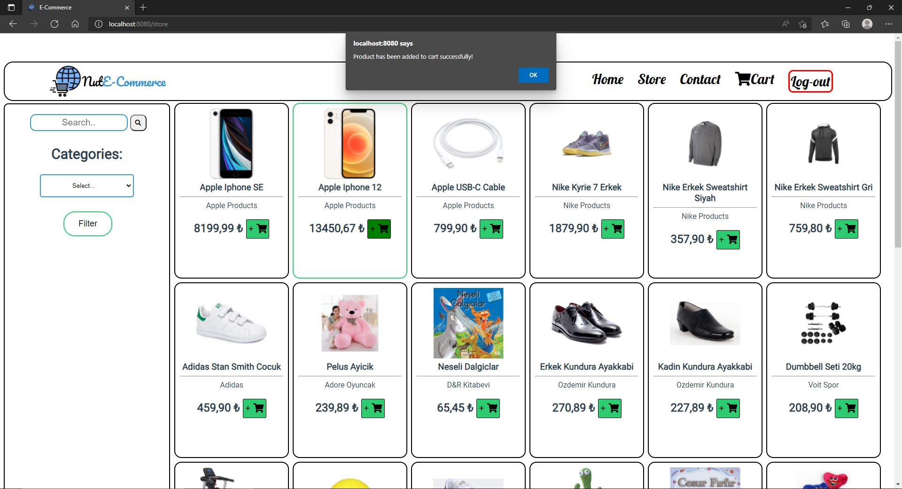

# SinglePageECommerce

A single-page application developed in vuejs in frontend and nodeJS in the backend.

Frontend Tools:
Axios, fontawesome, google fonts

Backend Tools:
Express, ElasticSearch, pg, jsonwebtoken, multer, winston, bcrypt, cookie-parser, cors, dotenv, joi

## DB Schema:


## BACKEND Folder Structure(./api/)

-config: configuration scripts for the application such as elasticsearch and db connection configurations and logger configs

-controllers: controllers for error handling, logging and handling requests and responses. Controllers are named according to processes.

-middleware: uploading image middleware and mail middleware to send verification mails. Mail verification is not added to the
controllers since mail account is needed.

-models: DB models are created as classes and functions to access the data are performed inside these models.

-public: Static served files by express are stored here. Used mostly for serving product images.

-routes: routes named by the endpoints. Assigns requests to the corresponding controllers.

-validators: Validators created by joi library to validate the incoming requests for authentication processes and product creation process.

## FRONTEND Folder Structure(./client/)

inside src folder

-assets: Holds the assets for the frontend. Only logo exists by the time.

-components: Holds Lower level components for pages. They are foldered according to page names and deeper level components are foldered accordingly to the component names.

-pages: Most composed components for the router to render.

-router: Assigning which components should be rendered on which endpoint.

## How to run the app;

.env file should be checked and changed for configuration.

Api:

```
cd api
npm install
npm start
```

Client:

```
cd client
npm install
npm run serve
```

## Screenshots of the app:

---

## HomePage:


## ContactPage:


## StorePage:


## LoginPage:


## RegisterPage:


## StorePage After Login:



## User Cart Page


## Seller Dashboard:


## Item Stock Option Changed:


## Item's Out of Stock on store:


## Search:


---


## Filter Shoes Category:


## Video of the App Running:

!Couldn't upload video since it is bigger than 10MB.
Can see the video in ./video/ProjectRunningVideo.mp4
